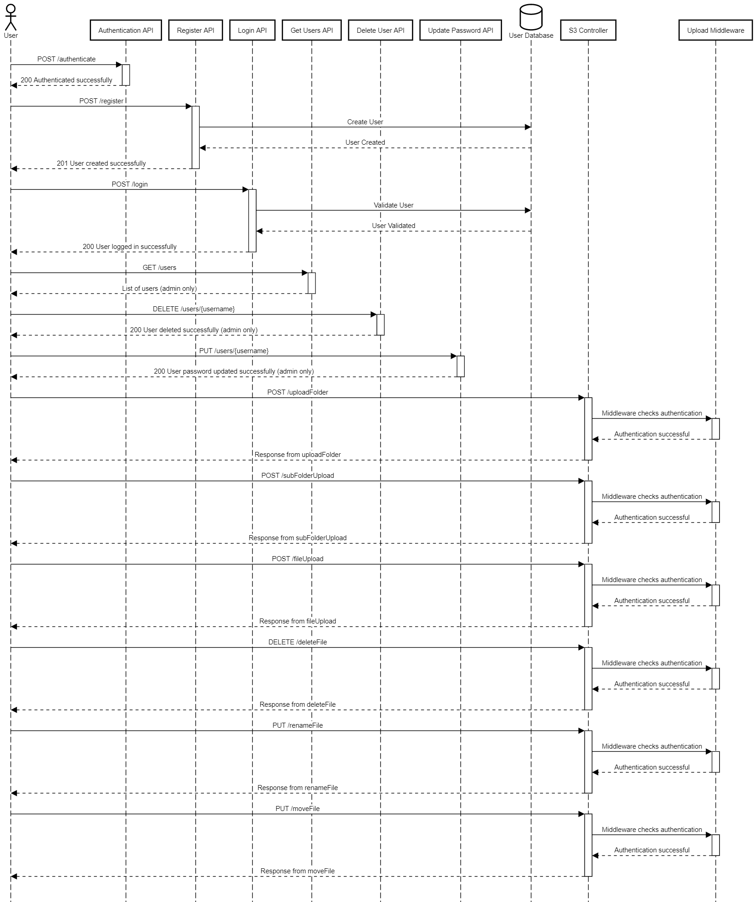

# Integrated API

## Overview

The Integrated API is a versatile RESTful API designed to manage files, folders, user registration, authentication, and management. This document provides an overview of the project's structure, endpoints, security features, and data models.

## Project Structure

The project is structured to handle different aspects, each encapsulated within its respective module:

- **User Management (`/api/user`):**
  - Handles user registration, authentication, and management.
  - Endpoints: `/register`, `/login`, `/users`, `/users/{username}`.

- **File and Folder Management (`/api/s3`):**
  - Manages file and folder operations.
  - Endpoints: `/uploadFolder`, `/subFolderUpload`, `/fileUpload`, `/deleteFile`, `/renameFile`, `/moveFile`.

- **Swagger Documentation (`/api-docs`):**
  - Provides API documentation using Swagger UI.
  - Endpoint: `/api-docs`.

- **Middleware and Dependencies:**
  - Express middleware for session management.
  - JWT for user authentication.
  - PostgreSQL database for persistent storage.

## Project Flow

1. **User Registration and Authentication:**
   - Users can register using the `/register` endpoint, providing a unique username, email, password, and role.
   - Authentication is handled through the `/login` endpoint, generating a JWT token upon successful login.

2. **User Management:**
   - Admins, identified by their JWT token, can access user-related operations like retrieving all users (`/users`), deleting a user (`/users/{username}`), and updating a user's password (`/users/{username}`).

3. **File and Folder Operations:**
   - Users can upload folders (`/uploadFolder`), subfolders (`/subFolderUpload`), and files (`/fileUpload`) using dedicated endpoints.
   - Operations such as deleting a file (`/deleteFile`), renaming a file (`/renameFile`), and moving a file (`/moveFile`) are available.

4. **Security:**
   - JWT is used for authentication, ensuring secure communication between the client and the server.
   - The API leverages the BearerAuth security scheme.

## Bonus Implementations
   - Implemented Role based acess control (e.g., admin, regular user) to manage access to certain API endpoints.

### Sequence Diagram

## Data Models

### User

- `id`: Unique identifier (integer).
- `username`: User's unique username (string).
- `email`: User's email address (string).
- `password_hash`: Hashed password (string).
- `role`: User's role (string).

### Folder

- `id`: Unique identifier (integer).
- `name`: Folder name (string).
- `created_by`: Username of the creator (string).
- `parent_folder`: Identifier of the parent folder (integer).
- `s3_object_key`: Object key for cloud storage (string).
- `created_at`: Creation timestamp (string, date-time format).

### File

- `id`: Unique identifier (integer).
- `name`: File name (string).
- `size`: File size in bytes (integer).
- `uploaded_by`: Username of the uploader (string).
- `parent_folder`: Identifier of the parent folder (integer).
- `s3_object_key`: Object key for cloud storage (string).
- `created_at`: Creation timestamp (string, date-time format).

## How to Run

1. Install dependencies: `npm install`
2. Start the server: `npm start`
3. Access Swagger documentation: [http://localhost:3000/api-docs](http://localhost:3000/api-docs)
4. Don't forgot to get you AWS key and ID put it in .env file and happy running.

Feel free to explore the API using the provided Swagger documentation and adapt the code according to your specific needs.
